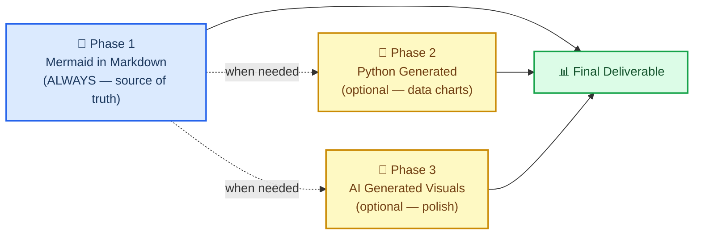
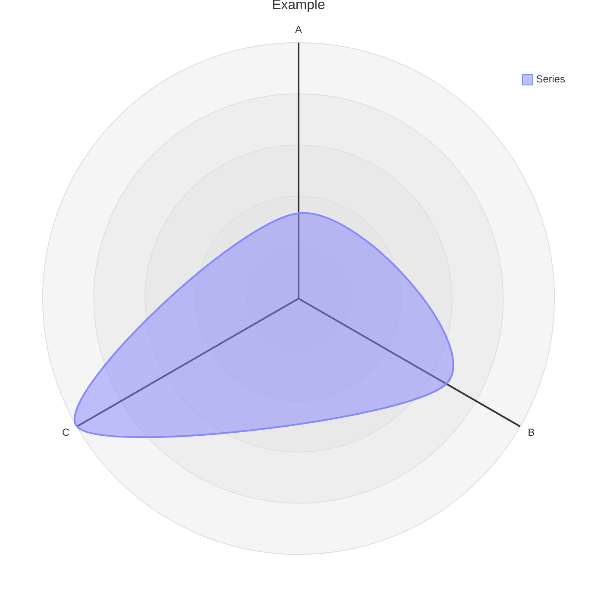

# Markdown和Mermaid写作

＃＃ 概述

这项技能会教您创建科学文档并强制执行标准
使用 **markdown 并嵌入Mermaid图表作为默认和规范格式**。

核心赌注：在`.md`文件中以Mermaid图表示的关系更重要
比任何图像都有价值。它是文本，因此它在 git 中的差异很明显。它不需要构建步骤。
它在 GitHub、GitLab、Notion、VS Code 和任何 Markdown 查看器上本地呈现。它使用
对相同关系的描述比散文要少。并且它永远可以是
后来转换为精美的图像 - 但文本版本仍然是事实的来源。

> “您越多地以常规文本形式获得 .md 格式的报告和文件，美人鱼就是
> 也是一种简单的“脚本语言”。这对任何下游渲染都有帮助
> 尤其是人工智能生成的图像（使用美人鱼而不是长文本来
> 描述关系<标记）。此外，mermaid 可以与 markdown 一起渲染
> 人类或人工智能几乎可以在任何地方轻松使用。”
>
> — Clayton Young (@borealBytes)，K-Dense Discord，2026-02-19

## 何时使用此技能

在以下情况下使用此技能：

- 创建**任何科学文档** - 报告、分析、手稿、方法部分
- 编写**任何文档** - 自述文件、操作方法、决策记录、项目文档
- 生成**任何图表** - 工作流程、数据管道、架构、时间表、关系
- 生成**任何将受版本控制的输出** — 如果要进入 git，则应该是 markdown
- 使用**任何其他技能** - 该技能定义了包装所有其他输出的文档层
- 有人要求你“添加图表”或“可视化关系”——首先是Mermaid

不要从 Python matplotlib、seaborn 或 AI 图像生成开始生成结构图或关系图。
这些是阶段 2 和阶段 3 — 仅当Mermaid无法表达所需内容时使用（例如，具有真实数据的散点图、真实感图像）。

## 🎨 源格式哲学

### 为什么基于文本的图表获胜

|重要的是|Markdown中的Mermaid| Python / AI 图像 |
| ----------------------------- | :-----------------: | :---------------: |
| Git diff 可读 | ✅ | ❌ 二进制 blob |
|可编辑，无需重新生成 | ✅ | ❌ |
|令牌效率与散文 | ✅ 更小 | ❌ 更大 |
|无需构建步骤即可渲染 | ✅ | ❌ 需要托管 |
|无需视觉即可由人工智能解析 | ✅ | ❌ |
|在 GitHub / GitLab / Notion 中工作 | ✅ | ⚠️ 如果托管 |
|无障碍（屏幕阅读器）| ✅ accTitle/accDecr | ⚠️ 需要替代文本 |
|稍后转换为图像 | ✅ 随时 | — 已经图像 |

### 三阶段工作流程



**第 1 阶段是强制性的。** 即使您继续进行第 2 或第 3 阶段，Mermaid源仍保持提交状态。

### Mermaid可以表达什么

Mermaid涵盖 24 种图表类型。几乎每一种科学关系都适合一个：

|使用案例|图表类型|文件 |
| -------------------------------------------------------- | ---------------- | ---------------------------------------------------------------- |
|实验工作流程/决策逻辑|流程图|`references/diagrams/flowchart.md`|
|服务交互/API通话/消息|序列|`references/diagrams/sequence.md`|
|数据模型/模式| ER图|`references/diagrams/er.md`|
|状态机/生命周期|状态|`references/diagrams/state.md`|
|项目时间表/路线图 |甘特图 |`references/diagrams/gantt.md`|
|比例/成分|馅饼|`references/diagrams/pie.md`|
|系统架构（缩放级别）| C4|`references/diagrams/c4.md`|
|概念层次/头脑风暴|思维导图 |`references/diagrams/mindmap.md`|
|按时间顺序排列的事件/历史|时间轴 |`references/diagrams/timeline.md`|
|类层次结构/类型关系|班级 |`references/diagrams/class.md`|
|用户旅程/满意度地图|用户旅程 |`references/diagrams/user_journey.md`|
|两轴比较/优先级 |象限|`references/diagrams/quadrant.md`|
|需求追溯|要求 |`references/diagrams/requirement.md`|
|流量大小/资源分布|桑基 |`references/diagrams/sankey.md`|
|数字趋势/条形图+折线图| XY 图表 |`references/diagrams/xy_chart.md`|
|组件布局/空间布置|块|`references/diagrams/block.md`|
|工作项状态/任务列 |看板|`references/diagrams/kanban.md`|
|云基础设施/服务拓扑|建筑|`references/diagrams/architecture.md`|
|多维度对比/技能雷达|雷达|`references/diagrams/radar.md`|
|层级比例/预算|树形图 |`references/diagrams/treemap.md`|
|二进制协议/数据格式 |数据包|`references/diagrams/packet.md`|
| Git 分支/合并策略 | Git 图表 |`references/diagrams/git_graph.md`|
|代码式序列（编程语法）| ZenUML |`references/diagrams/zenuml.md`|
|多图构图模式 |复杂的例子 |`references/diagrams/complex_examples.md`|

> 💡 **选择正确的类型，而不是简单的类型。** 不要默认所有事情都使用流程图。
> 对于按时间顺序排列的事件，时间线胜过流程图。对于
> 服务交互，序列胜过流程图。扫描表格并匹配。

---

## 🔧 核心工作流程

### 步骤 1：识别文档类型

在从头开始编写之前检查模板是否存在：

|文件类型 |模板|
| ------------------------------------------ | ----------------------------------------------------------- |
|拉取请求记录 |`templates/pull_request.md`|
|问题/错误/功能请求 |`templates/issue.md`|
|冲刺/项目委员会|`templates/kanban.md`|
|架构决策（ADR）|`templates/decision_record.md`|
|演示/简报 |`templates/presentation.md`|
|研究论文/分析 |`templates/research_paper.md`|
|项目文档|`templates/project_documentation.md`|
|操作方法/教程 |`templates/how_to_guide.md`|
|状态报告|`templates/status_report.md`|

### 步骤 2：阅读样式指南

在写入任何`.md`文件之前：阅读`references/markdown_style_guide.md`。

内化的关键规则：

- **每个文档一个 H1** — 标题。再也不会了。
- **仅 H2 标题上的表情符号** - 每个 H2 一个表情符号，H3/H4 中没有
- **引用所有内容** - 每个外部声明都有一个脚注`[^N]`和完整的 URL
- **谨慎粗体** - 每段最多 2-3 个粗体术语，从不完整句子
- **每个外部声明后的水平规则`</details>`** — 强制
- **散文上的表格**，用于比较、配置、结构化数据
- **文本墙壁上的图表** — 如果描述流程、结构或关系，请添加Mermaid

### 步骤 3：选择图表类型并阅读其指南

在创建任何图表之前Mermaid图：读`references/mermaid_style_guide.md`。

然后打开示例、提示和复制粘贴模板的特定类型文件（例如`references/diagrams/flowchart.md`）。

每个图表的强制规则：

```
accTitle: Short Name 3-8 Words
accDescr: One or two sentences explaining what this diagram shows.
```

- **无`%%{init}`指令** — 破坏 GitHub 深色模式
- **无内联`style`** — 仅使用`classDef`
- **每个节点最多一个表情符号** — 在标签开头
- **`snake_case`节点 ID** — 与标签
匹配
### 步骤4：编写文档

从模板开始。应用 Markdown 风格指南。将图表与相关文本放在一起，而不是放在单独的“图表”部分中。

### 步骤 5：以文本形式提交

提交的是嵌入了Mermaid的`.md`文件。如果您还生成了 PNG 或 AI 图像，那么这些图像是补充性的 - 降价是源。

---

## ⚠️ 常见陷阱

### 雷达图语法 (`radar-beta`)

**错误：**
```mermaid
radar
title Example
x-axis ["A", "B", "C"]
"Series" : [1, 2, 3]
```

**正确：**


- **使用`radar-beta`** 而不是`radar`（裸关键字不存在）
- **使用`axis`** 定义维度，**不**`x-axis`
- **使用`curve`** 定义数据系列，**不**带冒号的引用标签
- **否`accTitle`/`accDescr`** — 雷达测试版不支持辅助功能注释；始终在图表上方添加描述性斜体段落

### XY 海图与雷达混淆

|图表|关键词 |轴语法 |数据语法|
| -------- | -------- | ----------- | ----------- |
| **XY 图表**（条形图/折线图）|`xychart-beta`|`x-axis ["Label1", "Label2"]`|`bar [10, 20]`或`line [10, 20]`|
| **雷达**（蜘蛛/网）|`radar-beta`|`axis id["Label"]`|`curve id["Label"]{10, 20}`|

### 在支持的类型上忘记`accTitle`/`accDescr`

仅某些图表类型支持`accTitle`/`accDescr`。对于那些不这样做的人，请始终在代码块正上方放置一个描述性斜体段落：

> _Radar 图表比较跨五个性能维度的三种方法。注意：雷达图不支持 accTitle/accDescr._


---

## 🔗 与其他技能集成

### 使用`scientific-schematics`

`scientific-schematics`生成 AI 驱动的出版质量图像 (PNG)。使用Mermaid图作为原理图的**简要**：

```
Workflow:
1. Create the concept as Mermaid in .md (this skill — Phase 1)
2. Describe the same concept to scientific-schematics for a polished PNG (Phase 3)
3. Commit both — the .md as source, the PNG as a supplementary figure
```

### 与`scientific-writing`

`scientific-writing`制作稿件时，所有图表和结构图均应使用该技能的标准。写作技巧处理散文和引文；这项技能处理视觉结构。

```
Workflow:
1. Use scientific-writing to draft the manuscript
2. For every figure that shows a workflow, architecture, or relationship:
   - Replace placeholder with a Mermaid diagram following this skill's guide
3. Use scientific-schematics only for figures that truly need photorealistic/complex rendering
```

### 与`literature-review`

文献综述产生包含大量关系数据的摘要。使用此技能可以：

- 创建文献景观的概念图（思维导图）
- 显示出版时间线（时间线或甘特图）
- 比较方法（象限或雷达）
- 论文中描述的图表数据流（序列或流程图）

### 具有生成输出文档的任何技能

在最终确定任何技能的任何文档之前，请应用此技能的清单：

- [ ] 该文档是否使用模板？如果是这样，我是从正确的开始吗？
- [ ]Mermaid中的所有图表都包含`accTitle`+`accDescr`吗？
- [ ] 没有`%%{init}`，没有内联`style`，只有`classDef`？
- [ ] 是否所有外部声明都用`[^N]`引用？
- [ ] 一个 H1，只有 H2 上的表情符号？
- [ ] 每个`</details>`之后的水平规则？

---

## 📚 参考索引

### 样式指南

|指南|路径|线路 |它涵盖什么 |
| ----------------------- | ------------------------------------------- | -----| -------------------------------------------------- |
|Markdown风格指南 |`references/markdown_style_guide.md`| 〜733 |标题、格式、引文、表格、Mermaid集成、模板、质量检查表 |
|Mermaid风格指南 |`references/mermaid_style_guide.md`| 〜458 |辅助功能、表情符号集、颜色类别、主题中立性、类型选择、复杂性等级 |

### 图表类型指南（24 种）

每个文件包含：生产质量示例、特定于该类型的提示以及复制粘贴模板。

`references/diagrams/`— 架构、块、c4、类、复杂\_示例、呃、流程图、甘特图、git\_graph、看板、思维导图、数据包、饼图、象限、雷达、需求、桑基、序列、状态、时间线、树形图、用户\_旅程、xy\_chart、zenuml

### 文档模板（9 种）

`templates/`— Decision\_record、how\_to\_guide、issue、kanban、presentation、project\_documentation、pull\_request、research\_paper、status\_report

### 示例

`assets/examples/example-research-report.md`— 完整的科学研究报告展示正确的标题层次结构、多种图表类型（流程图、序列、甘特图）、表格、脚注引用、可折叠部分以及应用的所有样式指南规则。

---

## 📝 归属

本技能中的所有样式指南、图表类型指南和文档模板均根据 Apache-2.0 许可证从`SuperiorByteWorks-LLC/agent-project`存储库移植。

- **来源**：https://github.com/SuperiorByteWorks-LLC/agent-project
- **作者**：Clayton Young / Superior Byte Works, LLC (@borealBytes)
- **许可证**：Apache-2.0

此技能（作为科学代理技能的一部分）根据 MIT 许可证分发。所包含的 Apache-2.0 内容与下游使用兼容，并保留了属性，如本技能中文件头中所保留的那样。

---

[^1]：GitHub 博客。 （2022）。 “使用Mermaid将图表包含在Markdown文件中。”https://github.blog/2022-02-14-include-diagrams-markdown-files-mermaid/

[^2]：Mermaid。 “Mermaid绘图和图表工具。”https://mermaid.js.org/
