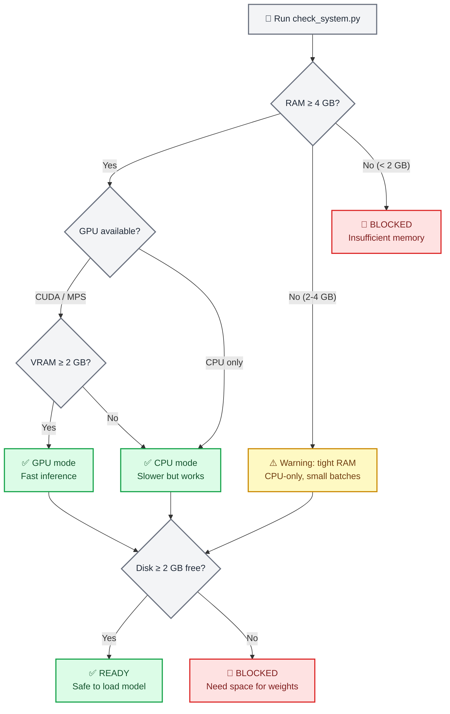
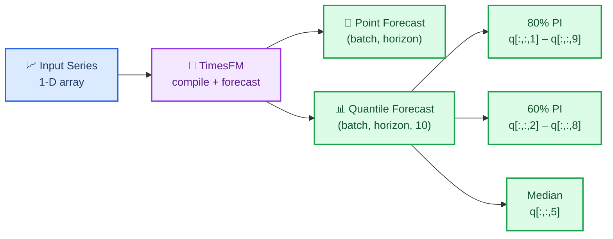
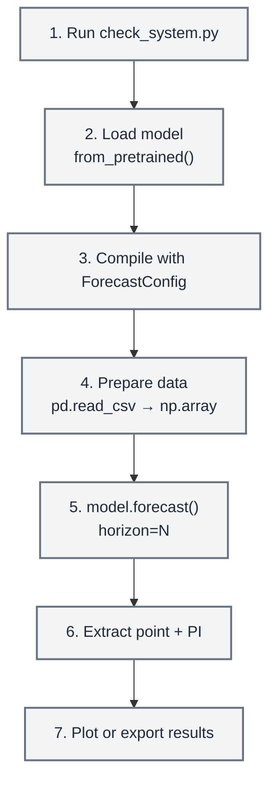
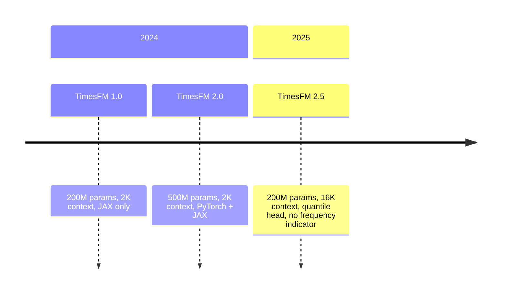

# TimesFM 预测

## 概述

TimesFM（时间序列基础模型）是预训练的仅解码器基础模型
由 Google Research 开发，用于时间序列预测。它的工作**零射击** - 喂它
任何单变量 time series，它返回带有校准分位数的点预测
预测间隔，无需训练。

此技能将 TimesFM 包装为安全、代理友好的本地 inference。它包括一个
**强制预检系统检查程序** 用于验证 RAM、GPU 内存和磁盘空间
在加载模型之前，代理不会使用户的计算机崩溃。

> **关键数字**：TimesFM 2.5 使用 200M 参数（磁盘上约 800 MB，RAM 上约 1.5 GB）
> CPU、GPU 上约 1 GB VRAM）。存档的 v1/v2 500M 参数模型需要 ~32 GB RAM。
> 始终先运行系统检查器。

## 何时使用此技能

在以下情况下使用此技能：

- 预测**任何单变量 time series**（销售、需求、传感器、生命体征、价格、天气）
- 您需要**零样本预测**而无需训练自定义模型
- 您想要具有校准预测区间（分位数）的**概率预测**
- 您有 **任意长度** 的 time series （模型处理 1–16,384 个上下文点）
- 您需要有效地**批量预测**数百或数千个系列
- 您需要 **基础模型** 方法，而不是手动调整 ARIMA/ETS 参数

在以下情况下**不要**使用此技能：

- 您需要带有系数解释的经典统计模型 → 使用 `statsmodels`
- 您需要time series分类或聚类→使用`aeon`
- 您需要多元向量自回归或格兰杰因果关系→使用`statsmodels`
- 您的数据是表格形式的（不是临时的）→使用 `scikit-learn`

> **关于异常检测的注意事项**：TimesFM 没有内置异常检测，但您可以
> 使用**分位数预测作为预测区间** — 90% CI (q10–q90) 之外的值
> 统计上不寻常。有关完整示例，请参阅 `examples/anomaly-detection/` 目录。

## ⚠️ 强制预检：系统要求检查

**重要 - 在首次加载模型之前始终运行系统检查器。**

```bash
python scripts/check_system.py
```

该脚本检查：

1. **可用 RAM** — 如果低于 4 GB 则发出警告，如果低于 2 GB 则阻止
2. **GPU 可用性** — 检测 CUDA/MPS 设备和 VRAM
3. **磁盘空间** — 验证 ~800 MB 模型下载的空间
4. **Python 版本** — 需要 3.10+
5. **现有安装** — 检查是否安装了 `timesfm` 和 `torch`

> **注意：**模型权重**不存储在此存储库中**。 TimesFM 权重 (~800 MB)
> 首次使用时从 HuggingFace 按需下载并缓存在 `~/.cache/huggingface/` 中。
> 预检检查程序可确保在任何下载开始之前有足够的资源。



### 不同模型版本的硬件要求

| 模型 | 参数 | 内存（CPU） | 显存（GPU） | 磁盘 | 背景 |
| ----- | ---------- | --------- | ---------- | ---- | ------- |
| **TimesFM 2.5**（推荐） | 200M | ≥4GB | ≥2GB | 〜800MB | 高达 16,384 |
| TimesFM 2.0（已存档） | 500M | ≥16GB | ≥8GB | 〜2GB | 最多 2,048 |
| TimesFM 1.0（已存档） | 200M | ≥8GB | ≥4GB | 〜800MB | 最多 2,048 |

> **建议**：始终使用 TimesFM 2.5，除非您有特定原因要使用 TimesFM 2.5。
> 较旧的检查站。它更小、更快，并且支持 8 倍长的上下文。

## 🔧 安装

### 第 1 步：验证系统（始终是第一位）

```bash
python scripts/check_system.py
```

### 步骤2：安装TimesFM

```bash
# Using uv (recommended by this repo)
uv pip install timesfm[torch]

# Or using pip
pip install timesfm[torch]

# For JAX/Flax backend (faster on TPU/GPU)
uv pip install timesfm[flax]
```

### 步骤 3：为您的硬件安装 PyTorch

```bash
# CUDA 12.1 (NVIDIA GPU)
pip install torch>=2.0.0 --index-url https://download.pytorch.org/whl/cu121

# CPU only
pip install torch>=2.0.0 --index-url https://download.pytorch.org/whl/cpu

# Apple Silicon (MPS)
pip install torch>=2.0.0  # MPS support is built-in
```

### 第 4 步：验证安装

```python
import timesfm
import numpy as np
print(f"TimesFM version: {timesfm.__version__}")
print("Installation OK")
```

## 🎯 快速入门

### 最小示例（5 行）

```python
import torch, numpy as np, timesfm

torch.set_float32_matmul_precision("high")

model = timesfm.TimesFM_2p5_200M_torch.from_pretrained(
    "google/timesfm-2.5-200m-pytorch"
)
model.compile(timesfm.ForecastConfig(
    max_context=1024, max_horizon=256, normalize_inputs=True,
    use_continuous_quantile_head=True, force_flip_invariance=True,
    infer_is_positive=True, fix_quantile_crossing=True,
))

point, quantiles = model.forecast(horizon=24, inputs=[
    np.sin(np.linspace(0, 20, 200)),  # any 1-D array
])
# point.shape == (1, 24)        — median forecast
# quantiles.shape == (1, 24, 10) — 10th–90th percentile bands
```

### 来自 CSV 的预测

```python
import pandas as pd, numpy as np

df = pd.read_csv("monthly_sales.csv", parse_dates=["date"], index_col="date")

# Convert each column to a list of arrays
inputs = [df[col].dropna().values.astype(np.float32) for col in df.columns]

point, quantiles = model.forecast(horizon=12, inputs=inputs)

# Build a results DataFrame
for i, col in enumerate(df.columns):
    last_date = df[col].dropna().index[-1]
    future_dates = pd.date_range(last_date, periods=13, freq="MS")[1:]
    forecast_df = pd.DataFrame({
        "date": future_dates,
        "forecast": point[i],
        "lower_80": quantiles[i, :, 2],  # 20th percentile
        "upper_80": quantiles[i, :, 8],  # 80th percentile
    })
    print(f"\n--- {col} ---")
    print(forecast_df.to_string(index=False))
```

### 协变量预测 (XReg)

TimesFM 2.5+通过`forecast_with_covariates()`支持外生变量。需要 `timesfm[xreg]`。

```python
# Requires: uv pip install timesfm[xreg]
point, quantiles = model.forecast_with_covariates(
    inputs=inputs,
    dynamic_numerical_covariates={"price": price_arrays},
    dynamic_categorical_covariates={"holiday": holiday_arrays},
    static_categorical_covariates={"region": region_labels},
    xreg_mode="xreg + timesfm",  # or "timesfm + xreg"
)
```

| 协变量类型 | 描述 | 示例 |
| -------------- | ----------- | ------- |
| `dynamic_numerical` | 时变数值 | 价格，temperature，促销花费 |
| `dynamic_categorical` | 时变分类 | 假日标志，星期几 |
| `static_numerical` | 每个系列的数字 | 商店规模、账户年龄 |
| `static_categorical` | 按系列分类 | 店铺类型、地区、产品类别 |

**XReg 模式：**
- `"xreg + timesfm"`（默认）：TimesFM先预测，然后XReg调整残差
- `"timesfm + xreg"`：首先拟合 XReg，然后 TimesFM 预测残差

> 有关合成零售数据的完整示例，请参阅 `examples/covariates-forecasting/`。

### 异常检测（通过分位数间隔）

TimesFM 没有内置异常检测，但 ** 分位数预测自然提供
可以检测异常的预测间隔**：

```python
point, q = model.forecast(horizon=H, inputs=[values])

# 90% prediction interval
lower_90 = q[0, :, 1]  # 10th percentile
upper_90 = q[0, :, 9]  # 90th percentile

# Detect anomalies: values outside the 90% CI
actual = test_values  # your holdout data
anomalies = (actual < lower_90) | (actual > upper_90)

# Severity levels
is_warning = (actual < q[0, :, 2]) | (actual > q[0, :, 8])  # outside 80% CI
is_critical = anomalies  # outside 90% CI
```

| 严重性 | 条件 | 解读 |
| -------- | --------- | -------------- |
| **正常** | 80% CI 以内 | 预期行为 |
| **警告** | 80% CI 之外 | 不寻常但有可能 |
| **关键** | 90% CI 之外 | 统计上罕见（< 10% 概率） |

> 有关可视化的完整示例，请参阅 `examples/anomaly-detection/`。

```python
# Requires: uv pip install timesfm[xreg]
point, quantiles = model.forecast_with_covariates(
    inputs=inputs,
    dynamic_numerical_covariates={"temperature": temp_arrays},
    dynamic_categorical_covariates={"day_of_week": dow_arrays},
    static_categorical_covariates={"region": region_labels},
    xreg_mode="xreg + timesfm",  # or "timesfm + xreg"
)
```

## 📊 理解输出

### 分位数预测结构

TimesFM 返回 `(point_forecast, quantile_forecast)`：

- **`point_forecast`**：形状 `(batch, horizon)` — 中位数（0.5 分位数）
- **`quantile_forecast`**：形状 `(batch, horizon, 10)` — 十片：

| 索引 | 分位数 | 使用 |
| ----- | -------- | --- |
| 0 | 平均值 | 平均预测 |
| 1 | 0.1 | 80% PI 的下限 |
| 2 | 0.2 | 60% PI 的下限 |
| 3 | 0.3 | — |
| 4 | 0.4 | — |
| **5** | **0.5** | **中位数 (= `point_forecast`)** |
| 6 | 0.6 | — |
| 7 | 0.7 | — |
| 8 | 0.8 | 60% PI 的上限 |
| 9 | 0.9 | 80% PI 的上限 |

### 提取预测区间

```python
point, q = model.forecast(horizon=H, inputs=data)

# 80% prediction interval (most common)
lower_80 = q[:, :, 1]  # 10th percentile
upper_80 = q[:, :, 9]  # 90th percentile

# 60% prediction interval (tighter)
lower_60 = q[:, :, 2]  # 20th percentile
upper_60 = q[:, :, 8]  # 80th percentile

# Median (same as point forecast)
median = q[:, :, 5]
```



## 🔧 ForecastConfig 参考

所有预测行为均由 `timesfm.ForecastConfig` 控制：

```python
timesfm.ForecastConfig(
    max_context=1024,                    # Max context window (truncates longer series)
    max_horizon=256,                     # Max forecast horizon
    normalize_inputs=True,               # Normalize inputs (RECOMMENDED for stability)
    per_core_batch_size=32,              # Batch size per device (tune for memory)
    use_continuous_quantile_head=True,   # Better quantile accuracy for long horizons
    force_flip_invariance=True,          # Ensures f(-x) = -f(x) (mathematical consistency)
    infer_is_positive=True,              # Clamp forecasts ≥ 0 when all inputs > 0
    fix_quantile_crossing=True,          # Ensure q10 ≤ q20 ≤ ... ≤ q90
    return_backcast=False,               # Return backcast (for covariate workflows)
)
```

| 参数 | 默认 | 何时改变 |
| --------- | ------- | -------------- |
| `max_context` | 0 | 设置为匹配最长的历史窗口（例如 512、1024、4096） |
| `max_horizon` | 0 | 设置为您的最大预测长度 |
| `normalize_inputs` | 错误 | **始终设置为 True** — 防止规模相关的不稳定 |
| `per_core_batch_size` | 1 | 增加吞吐量；如果 OOM 则减少 |
| `use_continuous_quantile_head` | 错误 | **为校准预测区间设置 True** |
| `force_flip_invariance` | 真实 | 保持 True 除非分析表明它会带来伤害 |
| `infer_is_positive` | 真实 | 对于可以为负数的系列设置 False（temperature，返回） |
| `fix_quantile_crossing` | 错误 | **设置 True** 以保证单调分位数 |

## 📋 常见工作流程

### 工作流程 1：单系列预测



```python
import torch, numpy as np, pandas as pd, timesfm

# 1. System check (run once)
# python scripts/check_system.py

# 2-3. Load and compile
torch.set_float32_matmul_precision("high")
model = timesfm.TimesFM_2p5_200M_torch.from_pretrained(
    "google/timesfm-2.5-200m-pytorch"
)
model.compile(timesfm.ForecastConfig(
    max_context=512, max_horizon=52, normalize_inputs=True,
    use_continuous_quantile_head=True, fix_quantile_crossing=True,
))

# 4. Prepare data
df = pd.read_csv("weekly_demand.csv", parse_dates=["week"])
values = df["demand"].values.astype(np.float32)

# 5. Forecast
point, quantiles = model.forecast(horizon=52, inputs=[values])

# 6. Extract prediction intervals
forecast_df = pd.DataFrame({
    "forecast": point[0],
    "lower_80": quantiles[0, :, 1],
    "upper_80": quantiles[0, :, 9],
})

# 7. Plot
import matplotlib.pyplot as plt
fig, ax = plt.subplots(figsize=(12, 5))
ax.plot(values[-104:], label="Historical")
x_fc = range(len(values[-104:]), len(values[-104:]) + 52)
ax.plot(x_fc, forecast_df["forecast"], label="Forecast", color="tab:orange")
ax.fill_between(x_fc, forecast_df["lower_80"], forecast_df["upper_80"],
                alpha=0.2, color="tab:orange", label="80% PI")
ax.legend()
ax.set_title("52-Week Demand Forecast")
plt.tight_layout()
plt.savefig("forecast.png", dpi=150)
print("Saved forecast.png")
```

### 工作流程 2：批量预测（许多系列）

```python
import pandas as pd, numpy as np

# Load wide-format CSV (one column per series)
df = pd.read_csv("all_stores.csv", parse_dates=["date"], index_col="date")
inputs = [df[col].dropna().values.astype(np.float32) for col in df.columns]

# Forecast all series at once (batched internally)
point, quantiles = model.forecast(horizon=30, inputs=inputs)

# Collect results
results = {}
for i, col in enumerate(df.columns):
    results[col] = {
        "forecast": point[i].tolist(),
        "lower_80": quantiles[i, :, 1].tolist(),
        "upper_80": quantiles[i, :, 9].tolist(),
    }

# Export
import json
with open("batch_forecasts.json", "w") as f:
    json.dump(results, f, indent=2)
print(f"Forecasted {len(results)} series → batch_forecasts.json")
```

### 工作流程 3：评估预测准确性

```python
import numpy as np

# Hold out the last H points for evaluation
H = 24
train = values[:-H]
actual = values[-H:]

point, quantiles = model.forecast(horizon=H, inputs=[train])
pred = point[0]

# Metrics
mae = np.mean(np.abs(actual - pred))
rmse = np.sqrt(np.mean((actual - pred) ** 2))
mape = np.mean(np.abs((actual - pred) / actual)) * 100

# Prediction interval coverage
lower = quantiles[0, :, 1]
upper = quantiles[0, :, 9]
coverage = np.mean((actual >= lower) & (actual <= upper)) * 100

print(f"MAE:  {mae:.2f}")
print(f"RMSE: {rmse:.2f}")
print(f"MAPE: {mape:.1f}%")
print(f"80% PI Coverage: {coverage:.1f}% (target: 80%)")
```

## ⚙️ 性能调整

### GPU加速

```python
import torch

# Check GPU availability
if torch.cuda.is_available():
    print(f"GPU: {torch.cuda.get_device_name(0)}")
    print(f"VRAM: {torch.cuda.get_device_properties(0).total_mem / 1e9:.1f} GB")
elif hasattr(torch.backends, "mps") and torch.backends.mps.is_available():
    print("Apple Silicon MPS available")
else:
    print("CPU only — inference will be slower but still works")

# Always set this for Ampere+ GPUs (A100, RTX 3090, etc.)
torch.set_float32_matmul_precision("high")
```

### 批量大小调整

```python
# Start conservative, increase until OOM
# GPU with 8 GB VRAM:  per_core_batch_size=64
# GPU with 16 GB VRAM: per_core_batch_size=128
# GPU with 24 GB VRAM: per_core_batch_size=256
# CPU with 8 GB RAM:   per_core_batch_size=8
# CPU with 16 GB RAM:  per_core_batch_size=32
# CPU with 32 GB RAM:  per_core_batch_size=64

model.compile(timesfm.ForecastConfig(
    max_context=1024,
    max_horizon=256,
    per_core_batch_size=32,  # <-- tune this
    normalize_inputs=True,
    use_continuous_quantile_head=True,
    fix_quantile_crossing=True,
))
```

### 内存受限环境

```python
import gc, torch

# Force garbage collection before loading
gc.collect()
if torch.cuda.is_available():
    torch.cuda.empty_cache()

# Load model
model = timesfm.TimesFM_2p5_200M_torch.from_pretrained(
    "google/timesfm-2.5-200m-pytorch"
)

# Use small batch size on low-memory machines
model.compile(timesfm.ForecastConfig(
    max_context=512,        # Reduce context if needed
    max_horizon=128,        # Reduce horizon if needed
    per_core_batch_size=4,  # Small batches
    normalize_inputs=True,
    use_continuous_quantile_head=True,
    fix_quantile_crossing=True,
))

# Process series in chunks to avoid OOM
CHUNK = 50
all_results = []
for i in range(0, len(inputs), CHUNK):
    chunk = inputs[i:i+CHUNK]
    p, q = model.forecast(horizon=H, inputs=chunk)
    all_results.append((p, q))
    gc.collect()  # Clean up between chunks
```

## 🔗 与其他技能的整合

### 带有 `statsmodels`

使用经典模型（ARIMA、SARIMAX）的 `statsmodels` 作为**比较基线**：

```python
# TimesFM forecast
tfm_point, tfm_q = model.forecast(horizon=H, inputs=[values])

# statsmodels ARIMA forecast
from statsmodels.tsa.arima.model import ARIMA
arima = ARIMA(values, order=(1,1,1)).fit()
arima_forecast = arima.forecast(steps=H)

# Compare
print(f"TimesFM MAE: {np.mean(np.abs(actual - tfm_point[0])):.2f}")
print(f"ARIMA MAE:   {np.mean(np.abs(actual - arima_forecast)):.2f}")
```

### 含 `matplotlib` / `scientific-visualization`

将预测与预测区间绘制为出版质量的数据。

### 带有 `exploratory-data-analysis`

在进行预测之前，在 time series 上运行 EDA，以了解趋势、季节性和平稳性。


## 📚 可用脚本

### `scripts/check_system.py`

**强制预检检查程序。** 在首次模型加载之前运行。

```bash
python scripts/check_system.py
```

输出示例：
```
=== TimesFM System Requirements Check ===

[RAM]       Total: 32.0 GB | Available: 24.3 GB  ✅ PASS
[GPU]       NVIDIA RTX 4090 | VRAM: 24.0 GB      ✅ PASS
[Disk]      Free: 142.5 GB                        ✅ PASS
[Python]    3.12.1                                 ✅ PASS
[timesfm]   Installed (2.5.0)                      ✅ PASS
[torch]     Installed (2.4.1+cu121)                ✅ PASS

VERDICT: ✅ System is ready for TimesFM 2.5 (GPU mode)
Recommended: per_core_batch_size=128
```

### `scripts/forecast_csv.py`

通过自动系统检查进行端到端 CSV 预测。

```bash
python scripts/forecast_csv.py input.csv \
    --horizon 24 \
    --date-col date \
    --value-cols sales,revenue \
    --output forecasts.csv
```

## 📖 参考文档

详细指南见`references/`：

| 文件 | 内容 |
| ---- | -------- |
| `references/system_requirements.md` | 硬件层、GPU/CPU 选择、内存估计公式 |
| `references/api_reference.md` | 完整的 `ForecastConfig` 文档、`from_pretrained` 选项、输出形状 |
| `references/data_preparation.md` | 输入格式、NaN 处理、CSV 加载、协变量设置 |

## 常见陷阱

1. **不运行系统检查** → 模型加载在低 RAM 机器上崩溃。始终先运行 `check_system.py`。
2. **忘记 `model.compile()`** → `RuntimeError: Model is not compiled`。必须在 `forecast()` 之前调用 `compile()`。
3. **不设置 `normalize_inputs=True`** → 对于大值序列的预测不稳定。
4. **在 RAM < 32 GB 的计算机上使用 v1/v2** → 使用 TimesFM 2.5（200M 参数）。
5. **不设置 `fix_quantile_crossing=True`** → 分位数可能不是单调的 (q10 > q50)。
6. **小型 GPU 上的巨大 `per_core_batch_size`** → CUDA OOM。从小处开始，逐渐增加。
7. **传递二维数组** → TimesFM 需要**一维数组**列表，而不是二维矩阵。
8. **忘记 `torch.set_float32_matmul_precision("high")`** → Ampere+ GPU 上 inference 速度较慢。
9. **不处理输出中的 NaN** → 序列非常短的边缘情况。请务必检查 `np.isnan(point).any()`。
10. **将 `infer_is_positive=True` 用于可能为负的序列** → 将预测限制为零。将 temperature、返回等设置为 False。

## 模型版本



| 版本 | 参数 | 背景 | 分位数头 | 频率标志 | 状态 |
| ------- | ------ | ------- | ------------- | -------------- | ------ |
| **2.5** | 200M | 16,384 | ✅ 连续（30M） | ❌ 已删除 | **最新** |
| 2.0 | 500M | 2,048 | ✅ 固定桶 | ✅ 必填 | 已存档 |
| 1.0 | 200M | 2,048 | ✅ 固定桶 | ✅ 必填 | 已存档 |

**Hugging Face 检查点：**

- `google/timesfm-2.5-200m-pytorch`（推荐）
- `google/timesfm-2.5-200m-flax`
- `google/timesfm-2.0-500m-pytorch`（已存档）
- `google/timesfm-1.0-200m-pytorch`（已存档）

## 资源

- **论文**：[用于时间序列预测的仅解码器基础模型](https://arxiv.org/abs/2310.10688) (ICML 2024)
- **存储库**：https://github.com/google-research/timesfm
- **Hugging Face**：https://huggingface.co/collections/google/timesfm-release-66e4be5fdb56e960c1e482a6
- **谷歌博客**：https://research.google/blog/a-decoder-only-foundation-model-for-time-series-forecasting/
- **BigQuery 集成**：https://cloud.google.com/bigquery/docs/timesfm-model

## 示例

`examples/` 中有三个完整工作的参考示例。将它们用作正确 API 使用和预期输出形状的基本事实。

| 示例 | 目录 | 它展示了什么 | 何时使用它 |
| ------- | --------- | -------------------- | -------------- |
| **全球气温预测** | `examples/global-temperature/` | 基本 `model.forecast()` 调用，CSV -> PNG -> GIF pipeline，36 个月 NOAA 上下文 | 起点；任何单变量系列的复制粘贴基线 |
| **异常检测** | `examples/anomaly-detection/` | 两阶段检测：线性去趋势+上下文Z分数，预测分位数PI； 2 面板可视化 | 任何需要对历史+预测数据进行异常值检测的任务 |
| **协变量 (XReg)** | `examples/covariates-forecasting/` | `forecast_with_covariates()` API (TimesFM 2.5)，协变量分解，2x2 共享轴即 | 零售、能源或任何具有已知外源驱动因素的系列 |

### 运行示例

```bash
# Global temperature (no TimesFM 2.5 needed)
cd examples/global-temperature && python run_forecast.py && python visualize_forecast.py

# Anomaly detection (uses TimesFM 1.0)
cd examples/anomaly-detection && python detect_anomalies.py

# Covariates (API demo -- requires TimesFM 2.5 + timesfm[xreg] for real inference)
cd examples/covariates-forecasting && python demo_covariates.py
```

### 预期产出

| 示例 | 关键输出文件 | 验收标准 |
| ------- | ---------------- | ------------------- |
| global-temperature | `output/forecast_output.json`、`output/forecast_visualization.png` | `point_forecast`有12个值； PNG 显示背景 + 预测 + PI 范围 |
| anomaly-detection | `output/anomaly_detection.json`、`output/anomaly_detection.png` | 2023 年 9 月标记为“严重”(z >= 3.0)； >= 2 预测来自注入异常的“严重” |
| covariates-forecasting | `output/sales_with_covariates.csv`、`output/covariates_data.png` | CSV 有 108 行（3 个商店 x 36 周）；商店有**不同的**价格数组 |

## 质量检查表

在宣布成功之前，在每个 TimesFM 任务之后运行此清单：

- [ ] **输出形状正确** -- `point_fc` 形状为 `(n_series, horizon)`，`quant_fc` 为 `(n_series, horizon, 10)`
- [ ] **分位数指数** -- 指数 0 = 平均值，1 = q10，2 = q20 ... 9 = q90。 **不是** 0 = q0，1 = q10。
- [ ] **频率标志** -- TimesFM 1.0/2.0：每月数据通过 `freq=[0]`。 TimesFM 2.5：无频率标志。
- [ ] **系列长度** - 上下文必须 >= 32 个数据点（模型最小值）。如果较短则警告。
- [ ] **没有 NaN** - `np.isnan(point_fc).any()` 应该为 False。首先检查输入系列是否存在间隙。
- [ ] **可视化轴** - 如果多个面板共享数据，请使用 `sharex=True`。所有时间轴必须覆盖相同的跨度。
- [ ] **Git LFS 中的二进制输出** - PNG 和 GIF 文件必须通过 `.gitattributes` 进行跟踪（存储库根目录已配置）。
- [ ] **没有提交大型数据集** - 任何大于 1 MB 的真实数据集都应下载到 `tempfile.mkdtemp()` 并在代码中进行注释。
- [ ] **`matplotlib.use('Agg')`** -- 在无头运行时必须出现在任何 pyplot 导入之前。
- [ ] **`infer_is_positive`** -- 为 temperature 异常、财务回报或任何可能为负的系列设置 `False`。

## 常见错误

这些错误已经出现在该技能的示例中。向他们学习：

1. **分位数指数相差一**——最常见的错误。 `quant_fc[..., 0]` 是**平均值**，而不是 q0。 q10 = 索引 1，q90 = 索引 9。始终定义命名常量：`IDX_Q10, IDX_Q20, IDX_Q80, IDX_Q90 = 1, 2, 8, 9`。

2. **推导式中的变量遮蔽** -- 如果您在循环内构建每系列协变量字典，请勿使用循环变量作为推导式变量。在循环外累加到单独的`dict[str, ndarray]`中，然后赋值。
   ```python
   # WRONG -- outer `store_id` gets shadowed:
   covariates = {store_id: arr[store_id] for store_id in stores}  # inside outer loop over store_id
   # CORRECT -- use a different name or accumulate beforehand:
   prices_by_store: dict[str, np.ndarray] = {}
   for store_id, config in stores.items():
       prices_by_store[store_id] = compute_price(config)
   ```

3. **错误的 CSV 列名称** -- global-temperature CSV 使用 `anomaly_c`，而不是 `anomaly`。访问前始终为 `print(df.columns)`。

4. **`tight_layout()` 带有 `sharex=True` 的警告** -- 无害；使用 `plt.tight_layout(rect=[0, 0, 1, 0.97])` 抑制或忽略。

5. **`forecast_with_covariates()` 需要 TimesFM 2.5** -- TimesFM 1.0 没有此方法。安装 `pip install timesfm[xreg]` 并使用检查点 `google/timesfm-2.5-200m-pytorch`。

6. **未来协变量必须跨越整个范围** - 动态协变量（价格、促销、假期）必须具有上下文和预测范围的值。您不能传递仅上下文数组。

7. **异常阈值必须定义一次** -- 将 `CRITICAL_Z = 3.0`、`WARNING_Z = 2.0` 定义为模块级常量。切勿内联硬编码 `3` 或 `2`。

8. **上下文异常检测使用残差，而不是原始值** - 始终首先去趋势（`np.polyfit` 线性或季节性分解），然后对残差进行 Z 评分。原始值 Z 分数对趋势数据具有误导性。

## 验证与验证

使用示例输出作为回归基线。如果您更改预测逻辑，请验证：

```bash
# Anomaly detection regression check:
python -c "
import json
d = json.load(open('examples/anomaly-detection/output/anomaly_detection.json'))
ctx = d['context_summary']
assert ctx['critical'] >= 1, 'Sep 2023 must be CRITICAL'
assert any(r['date'] == '2023-09' and r['severity'] == 'CRITICAL'
           for r in d['context_detections']), 'Sep 2023 not found'
print('Anomaly detection regression: PASS')"

# Covariates regression check:
python -c "
import pandas as pd
df = pd.read_csv('examples/covariates-forecasting/output/sales_with_covariates.csv')
assert len(df) == 108, f'Expected 108 rows, got {len(df)}'
prices = df.groupby('store_id')['price'].mean()
assert prices['store_A'] > prices['store_B'] > prices['store_C'], 'Store price ordering wrong'
print('Covariates regression: PASS')"
```

