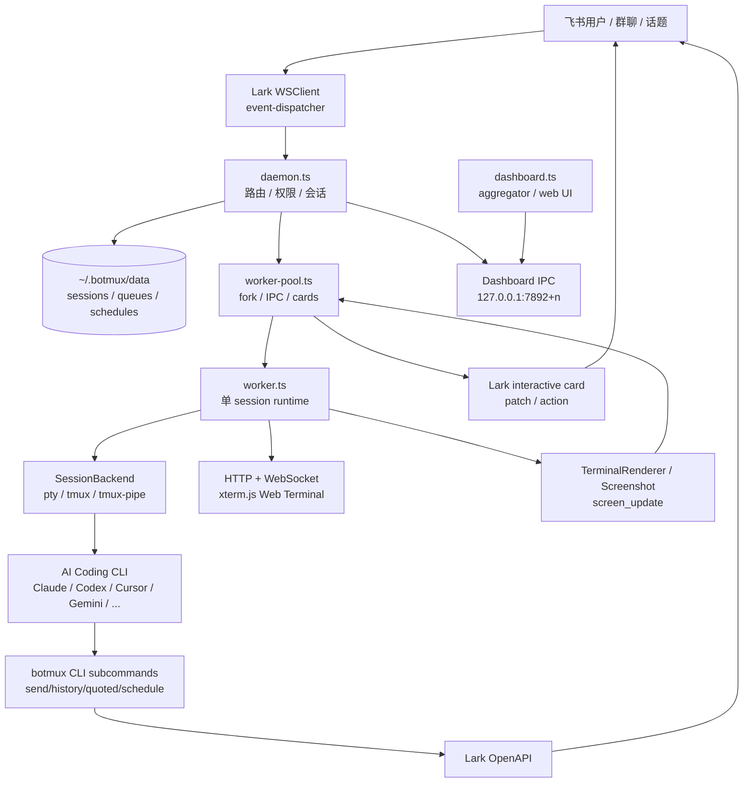
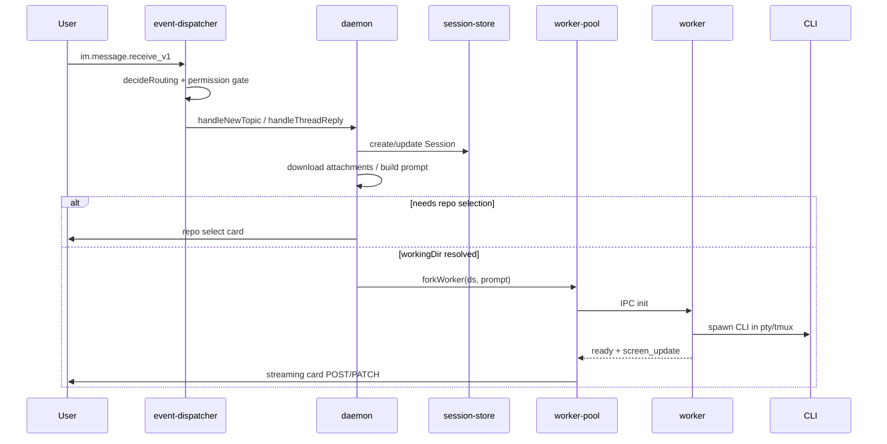

# botmux 项目架构设计分析

## 一句话结论

botmux 是一个把飞书话题群和 AI 编程 CLI 直接桥接起来的本地守护系统。它解决的不是“如何重新实现一个 Agent”，而是“如何让已有的 Claude Code、Codex、Cursor、Gemini、OpenCode、Antigravity 等完整 CLI 进程，安全、可恢复、可观测地运行在飞书会话背后”。

它的核心架构取舍是：**复用 CLI 原生能力，围绕 CLI 进程构建 IM 路由、终端会话、卡片流式展示、权限、持久化和管理面**。

## 项目主要解决什么问题

### 背景问题

AI 编程 CLI 已经具备比较完整的能力：上下文管理、工具调用、权限弹窗、文件编辑、记忆、Skill、Hook、斜杠命令、TUI 交互等。但这些能力通常绑定在本地终端里，协作入口和远程观察体验较弱。

实际团队使用时会遇到几个问题：

- 用户在飞书里提出需求，但真正执行还要切到本机终端。
- AI CLI 的运行过程无法方便地在群聊里同步给其他人。
- 长任务、手机端查看、多人协作、跨机器人协作都缺少统一入口。
- daemon 重启、网络波动、CLI 崩溃容易导致会话断裂。
- 如果重新用 Agent SDK 实现，会丢失 CLI 原生能力，并持续追赶上游 CLI 的快速变化。

### botmux 的解法

botmux 用一个本地 daemon 监听飞书消息：每个飞书话题或普通群会话映射到一个独立 CLI session。用户发消息后，daemon fork 一个 worker，worker 启动或重连一个 CLI 进程，并提供：

- 飞书流式卡片：显示启动中、工作中、空闲、限流等状态，并能打开 Web terminal。
- Web terminal：基于 xterm.js 的可交互终端，支持只读链接和带 token 的写入链接。
- tmux 持久化：默认用 tmux 保存 CLI 进程，daemon 重启后可以 re-attach。
- 多 bot 支持：一个 bot 配一种 CLI，同群通过 @mention 路由。
- Skill + CLI 子命令：让 CLI 里的 Agent 能用 `botmux send/history/quoted/schedule/bots` 操作飞书上下文。
- Dashboard：跨 daemon 管理 session、schedule、group、workflow。
- Workflow：基于事件日志的多节点 Agent 编排，支持 human gate、cancel、resume、dashboard 观察。

## 核心设计理念

### 1. Bridge CLI, do not rebuild Agent

README 明确写了“不做 SDK wrapper，直接桥接 CLI”。源码也体现了这一点：

- CLI 能力通过 `src/adapters/cli/*` 适配，而不是在 botmux 内部重写模型循环。
- 终端交互通过 `src/adapters/backend/*` 适配 pty/tmux，而不是把 CLI 降级成 API 调用。
- Skills 写入各 CLI 的 skill 目录，Agent 仍通过 shell 命令调用 botmux，而不是依赖 MCP 握手。
- Claude/OpenCode 这类支持 hook 的 CLI，通过 hook 接管 AskUserQuestion；不支持 hook 的 CLI 用 `botmux-ask` skill 兜底。

这个设计让 botmux 的价值集中在“连接层”和“运维体验”，而不是和上游 CLI 在 Agent 能力上重复建设。

### 2. 一个飞书会话对应一个独立终端会话

会话单位由 `src/im/lark/event-dispatcher.ts` 里的 routing 逻辑决定：

- thread-scope：话题群、私聊 top-level、显式 `/t` 创建的话题，anchor 是 root message id。
- chat-scope：普通群默认整群一个 session，anchor 是 chat id。

daemon 用 `sessionKey(anchor, larkAppId)` 区分不同 bot 在同一 anchor 上的独立会话。这样多 bot 能在同一个话题里各自运行独立 CLI。

### 3. daemon 管会话，worker 管终端

核心职责分离：

- daemon：飞书事件、权限、路由、会话表、卡片、Dashboard IPC、scheduler、workflow。
- worker：单个 CLI 进程、PTY/tmux backend、Web terminal、屏幕渲染、输入写入、idle 检测、截图上传、adopt transcript 桥接。

这让 worker 崩溃不会直接拖垮整个 daemon，也让每个 CLI session 的终端状态隔离。

### 4. 本地文件是系统状态总线

项目大量使用 `~/.botmux/data` 下的 JSON/JSONL 文件作为持久化层：

- `sessions-<appId>.json`：per-bot session。
- `schedules.json`：定时任务。
- `queues/<anchor>.jsonl`：飞书消息队列。
- `frozen-card-store`：历史流式卡片状态。
- `dashboard-daemons/*`：daemon registry 心跳。
- workflow runs dir：事件日志、attempt sidecar、blob。

这是一个偏“本地 daemon 产品”的设计：部署简单、无外部数据库，但需要非常谨慎地处理原子写、跨进程读写和恢复。

## 总体架构图



## 运行入口与部署模型

### CLI 入口

主入口是 `src/cli.ts`，构建后作为 `botmux` 命令暴露。

主要命令：

- `botmux setup`：交互式配置飞书应用、bots.json、权限 JSON。
- `botmux start/stop/restart/status/logs`：通过 PM2 管理 daemon。
- `botmux dashboard`：向 dashboard 进程申请一次性 token URL。
- `botmux list/delete/resume`：管理 session。
- `botmux send/history/quoted/bots/schedule`：给 CLI 内的 Agent 使用。
- `botmux autostart`：注册 launchd 或 user systemd。

`src/cli.ts` 还会生成 PM2 ecosystem 配置：每个 bot 一个 daemon 进程，另有一个 `botmux-dashboard` 进程。

### Daemon 入口

`src/index-daemon.ts` 负责加载 `~/.botmux/.env` 或项目 `.env`，读取全局语言配置，然后动态 import `src/daemon.ts`。动态 import 的目的很明确：确保 `config.ts` 读取环境变量前 dotenv 已完成加载。

`startDaemon(botIndex)` 的核心启动流程：

1. 加载 bots.json，并只注册当前 `BOTMUX_BOT_INDEX` 对应的 bot。
2. 安装 CLI skills 和 hook。
3. 初始化 session store、schedule watcher。
4. 启动 Dashboard IPC server。
5. 写 dashboard daemon descriptor 并定时 heartbeat。
6. 探测 bot open_id、检查权限 scope。
7. 启动 Lark WSClient 事件分发。
8. 从持久化恢复活跃 session。
9. cold attach 未完成 workflow run。
10. 启动 scheduler。
11. 注册 graceful shutdown，保护 worker/tmux 生命周期。

## 模块分层

### 1. IM 接入层：`src/im/lark/*`

职责：

- 建立飞书长连接：`event-dispatcher.ts`
- 调用飞书 OpenAPI：`client.ts`
- 解析消息：`message-parser.ts`
- 构建交互卡片：`card-builder.ts`、`md-card.ts`
- 处理卡片按钮：`card-handler.ts`
- workflow/ask/grant 专用卡片处理

关键设计点：

- 用 `decideRouting()` 把飞书消息映射成 thread/chat scope。
- 普通群默认 chat-scope；话题群、私聊 top-level、`/t` 强制 thread-scope。
- 对 chat mode 做缓存，但在疑似群模式转换时 force refresh，避免普通群和话题群之间切换后路由错乱。
- `canTalk` 和 `canOperate` 分离：对话权限和敏感操作权限不是一回事。
- 多 bot 场景下，未 @ 的消息通常会被忽略，避免同群多个 bot 同时响应。

### 2. 会话编排层：`src/daemon.ts` + `src/core/session-manager.ts`

职责：

- 创建、恢复、关闭 session。
- 处理新话题、thread reply、普通群 auto-create。
- 下载附件并把本地路径注入 prompt。
- 根据 oncall/defaultWorkingDir/repo-select 确定 workingDir。
- 构造初始 prompt、follow-up prompt、refork prompt。
- 调度 worker。

一个新消息的大致链路：



### 3. Worker pool：`src/core/worker-pool.ts`

职责：

- fork worker process。
- 给 worker 注入环境变量：`BOTMUX=1`、`SESSION_DATA_DIR`、`LARK_APP_ID`、`LARK_APP_SECRET`，并把 `~/.botmux/bin` 加到 PATH。
- 处理 worker IPC：ready、screen_update、screenshot_uploaded、tui_prompt、final_output、claude_exit 等。
- 创建和 PATCH 飞书流式卡片。
- 管理卡片更新的串行队列，避免多个 PATCH 乱序覆盖。
- 管理 crash loop auto-restart。
- 向 dashboard event bus 发布 session 状态。

比较重要的细节：

- `CARD_POSTING_SENTINEL` 防止 ready/screen_update 并发时重复 POST 卡片。
- `scheduleCardPatch()` 做 per-session latest-wins PATCH 队列，避免飞书卡片更新乱序。
- 新 turn 会创建新 streaming card，旧 card 会被 park/freeze，然后在新 card 成功后 recall，保证“旧卡不在新卡可见前消失”。
- adopt bridge 的 `final_output` 由 daemon 负责重试发送，worker 只 emit 一次。

### 4. Worker runtime：`src/worker.ts`

职责：

- 启动一个 HTTP + WebSocket server，提供 xterm.js Web terminal。
- 选择 backend 并 spawn CLI。
- 收集 PTY/tmux 输出，生成 screen_update。
- 做 idle detection 和 prompt_ready。
- 将 daemon 传来的 message/raw_input 写入 CLI。
- 处理 TUI prompt、快捷键、截图、display mode。
- /adopt 模式下 tail Claude/Codex transcript，做 final_output 桥接。

worker 是项目里最复杂的文件，原因是它要处理真实终端世界的各种细节：

- Ink/TUI 对“快速粘贴 + Enter”的处理差异。
- tmux copy-mode 和 Web terminal 输入冲突。
- Claude/Codex transcript 文件轮转、resume、clear。
- usage limit 检测与 retry-ready 状态。
- Web terminal 只读/可写 token。
- Workflow worker 模式下跳过聊天侧卡片，但保留 Web terminal 观察。

### 5. CLI Adapter：`src/adapters/cli/*`

`CliAdapter` 是把不同 AI CLI 差异收敛起来的接口。

关键字段和方法：

- `buildArgs()`：构造 CLI 启动参数。
- `writeInput()`：把用户消息可靠提交到 CLI。
- `buildResumeCommand()`：构造 CLI 原生命令行 resume 指令。
- `skillsDir`：内置 skills 安装位置。
- `hookInstall` / `asksViaHook`：AskUserQuestion hook 支持。
- `completionPattern` / `readyPattern`：帮助 idle detector 判断 CLI 是否可输入。
- `injectsSessionContext`：是否通过 CLI flags 注入 botmux system prompt。
- `supportsTypeAhead`：是否允许忙时提前写入输入。

当前支持的 CLI id：

- `claude-code`
- `aiden`
- `coco`
- `codex`
- `cursor`
- `gemini`
- `opencode`
- `antigravity`
- `mtr`

### 6. Backend Adapter：`src/adapters/backend/*`

`SessionBackend` 抽象终端承载方式：

- `PtyBackend`：直接用 `node-pty` spawn CLI。简单，但 daemon/worker 重启会中断 CLI。
- `TmuxBackend`：传统 pty-under-tmux attach/new-session，kill 只 detach，destroySession 才杀 tmux session。
- `TmuxPipeBackend`：当前实际优先路径。它不 attach tmux，而是用 `tmux pipe-pane` 复制 pane 输出到 FIFO，再用 `send-keys/paste-buffer` 写入。

`TmuxPipeBackend` 的价值很大：

- 避免普通 attach 和 iTerm2 control mode 等客户端同时存在时 ANSI/control protocol 混杂。
- /adopt 场景可以“观察和输入”用户已有 tmux pane，但不侵入 attach 状态。
- 通过 `capture-pane` 给新 Web terminal 连接补首屏。
- 对 pane 消失、send-keys 失败做 crash-safe 处理，避免 unhandled rejection 杀 worker。

## 核心数据模型

### Session

定义在 `src/types.ts`。

重要字段：

- `sessionId`：botmux 自己的 session UUID。
- `chatId`：飞书 chat id。
- `rootMessageId`：thread-scope 的 root message；chat-scope 下只是首条消息审计字段。
- `scope`：`thread` 或 `chat`。
- `workingDir`：CLI 工作目录。
- `webPort`：Web terminal 端口。
- `larkAppId`：所属 bot。
- `ownerOpenId` / `lastCallerOpenId`：用于 @mention 和 oncall 场景下回给真正触发者。
- `quoteTargetId`：普通群 chat-scope 下维持引用链。
- `streamCardId` / `streamCardNonce` / `displayMode` / `currentImageKey`：流式卡片恢复状态。
- `cliSessionId`：CLI 原生 session id，如 Codex/Claude 的 resume id。
- `adoptedFrom`：/adopt 接入外部 tmux pane 的元信息。

### DaemonSession

定义在 `src/core/types.ts`，是运行时态，比 `Session` 多：

- `worker` / `workerPort` / `workerToken`
- `pendingRepo` / `pendingPrompt` / `pendingFollowUps`
- `streamCardPending` / `lastScreenContent` / `lastScreenStatus`
- `tuiPromptCardId` / `tuiPromptOptions`
- `frozenCards`
- `usageLimitRetryTimer`

这体现了一个典型边界：`Session` 是可持久化业务状态，`DaemonSession` 是 daemon 内存中的运行时控制状态。

### Routing Key

`sessionKey(anchorId, larkAppId)` 形式为：

```text
<anchorId>::<larkAppId>
```

其中：

- thread-scope：anchor 是 rootMessageId。
- chat-scope：anchor 是 chatId。

这个设计解决两个问题：

1. 同一飞书话题可以被多个 bot 独立拥有。
2. 普通群 chat-scope 与话题 thread-scope 的地址空间不会冲突，因为飞书 chat id 通常是 `oc_`，message id 通常是 `om_`。

## 飞书消息路由设计

### 路由决策

`decideRouting()` 的规则：

- 有 `root_id` 且有 `thread_id`：thread-scope，anchor = root_id。
- 私聊 top-level：thread-scope，anchor = message_id。
- 群聊若 chat mode 是 topic：thread-scope，anchor = message_id。
- 普通群 top-level：chat-scope，anchor = chat_id。

额外处理：

- Lark 引用气泡可能只有 `root_id` 没有 `thread_id`，不能误判成 thread。
- `/t` 或 `/topic` 可以在普通群强制开一个 thread-scope session。
- 群模式在普通群和话题群之间切换时，会 force refresh chat mode 并修正 routing。

### 权限分层

`canTalk` 和 `canOperate` 是两个不同权限面：

- `canTalk`：能不能把消息喂给 bot。
- `canOperate`：能不能执行 `/close`、`/restart`、终端写入链接、卡片敏感按钮等。

oncall 群会放开 canTalk，但敏感操作仍由 allowedUsers 控制。这是合理的：团队群可以让大家提需求，但不能让所有人管理 daemon 或控制终端。

### 多 bot 协作

多 bot 场景依赖几类信息：

- `bots-info.json`：每个 daemon 写自己的 bot 名称、open_id、cliId。
- `bot-openids-<appId>.json`：每个 app 视角下学习到的其他 bot open_id。
- `/introduce`：让 bot 互相登记身份。
- @mention 路由：同群多个 bot 时，未 @ 的消息通常不响应。

这套机制让一个群里可以同时有 Claude bot、Codex bot、Gemini bot，各自独立开 session，也可以互相 @。

## 流式卡片与 Web terminal

### 流式卡片状态

卡片状态来自 worker 的 `screen_update`：

- `starting`
- `working`
- `analyzing`
- `idle`
- `limited`
- `retry_ready`

卡片不直接显示完整终端文本作为主模式，而是支持：

- hidden：默认隐藏输出，只显示状态和按钮。
- screenshot：上传终端截图，通过飞书图片展示。

这说明项目在处理飞书卡片大小限制和 TUI 输出复杂性时，选择了“状态 + 可打开终端 + 可选截图”的体验，而不是把所有 ANSI 输出硬转 markdown 塞进卡片。

### Web terminal

worker 内置 HTTP server 和 WebSocket：

- 读链接：展示终端输出。
- 写链接：带随机 token，可以操作 CLI。
- 移动端有快捷键工具栏。
- tmux 模式下，每个 WebSocket client 可以通过 tmux 或 pipe 后端同步终端状态。

这个设计让飞书卡片只是“协作入口”，真正完整交互仍回到终端。

## Skills、Hook 与 CLI 子命令

### 为什么不用 MCP 作为主链路

项目历史上清理了 legacy MCP config。当前设计把 `botmux` CLI 子命令作为 Agent 和飞书的桥：

- 不需要每个 CLI 都支持 MCP。
- 不占用模型工具列表 token。
- Skill 文档可以引导 Agent 在适当时机调用 shell 命令。
- 对 Claude/Codex/Gemini/OpenCode 等 CLI 都统一。

### 内置 Skills

`src/skills/definitions.ts` 定义了内置 skill：

- `botmux-send`：向当前飞书话题发消息，支持 markdown、图片、文件、@mention。
- `botmux-history`：读取当前 thread/chat/ambient 历史。
- `botmux-quoted`：读取用户引用的消息。
- `botmux-schedule`：创建和管理定时任务。
- `botmux-ask`：无 hook CLI 的 askUserQuestion 兜底。

### Hook

`src/core/worker-pool.ts` 里 `ensureCliEnv()` 会：

1. 安装 skills。
2. 安装 AskUserQuestion hook。
3. 清理旧 MCP 配置。

Claude/OpenCode 等 adapter 可以通过 `hookInstall` 接管原生 askUserQuestion，避免 Agent 自己用 skill 弹问题卡时和原生 hook 双重触发。

## 定时任务架构

核心文件：

- `src/core/scheduler.ts`
- `src/services/schedule-store.ts`
- `src/core/command-handler.ts` 的 `/schedule`
- `botmux schedule` CLI 子命令

设计特点：

- 支持 once、interval、cron。
- 支持中文自然语言：`每日17:50`、`每周一10:00`、`30分钟后`、`明天9:00`。
- daemon 每 30 秒 tick。
- 多 bot 模式下每个 daemon 都跑 scheduler，但只执行属于自己 `larkAppId` 的 task；legacy task 由 bot-0 处理。
- recurring task 在执行前先推进 nextRunAt，避免 crash mid-run 后重复触发。
- store 里有 workflow idempotency 支持：workflow 创建 schedule 时可指定稳定 id，并用 canonical input hash 防止重试变更语义。

执行策略上，定时任务会在原 chat/thread 里继续，把 prompt 注入现有 session 或创建/恢复 session。

## Dashboard 架构

核心文件：

- `src/dashboard.ts`
- `src/dashboard/registry.ts`
- `src/dashboard/aggregator.ts`
- `src/core/dashboard-ipc-server.ts`
- `src/dashboard/web/*`

架构上 dashboard 是一个独立 PM2 进程：

1. daemon 启动后在 `~/.botmux/data/dashboard-daemons` 写 descriptor，并定时 heartbeat。
2. dashboard 通过 registry 发现在线 daemon。
3. dashboard 先从 daemon IPC 拉取 snapshot，再订阅 SSE。
4. dashboard aggregator 在内存里合并多 daemon 的 session/schedule/group 状态。
5. mutation 操作通过 dashboard proxy 回 owning daemon 执行。

这种设计避免 dashboard 直接 import daemon 内存，也避免多 bot、多进程状态散落在前端。

认证设计：

- dashboard 有本地 secret：`~/.botmux/.dashboard-secret`。
- `botmux dashboard` 通过 loopback HMAC 请求 rotate token。
- Web UI 用一次性 token 换 cookie。

## Workflow 架构

Workflow 是这个项目里第二条较复杂的执行系统，和普通聊天 session 并列。

核心文件：

- `src/workflows/definition.ts`
- `src/workflows/events/*`
- `src/workflows/orchestrator.ts`
- `src/workflows/runtime.ts`
- `src/workflows/loop.ts`
- `src/workflows/resume.ts`
- `src/workflows/cancel-run.ts`
- `src/workflows/hostExecutors/*`
- `src/workflows/spawn-bot.ts`
- `src/workflows/daemon-spawn.ts`

### 核心设计

Workflow 使用 event sourcing：

- `EventLog` 追加事件。
- `replay()` 生成 Snapshot。
- `orchestrator.ts` 是纯决策层：从 Snapshot + Definition 推导下一步 Action。
- `runtime.ts` 是副作用层：写事件、spawn subagent、执行 host executor。
- `loop.ts` 驱动 `decideNextActions -> dispatch -> replay -> settle`，直到 terminal、awaiting-wait 或 no-progress。

这个架构的好处：

- 运行状态可恢复。
- dangling effect 可以通过 reconciler 恢复。
- dashboard 可以直接读 run event log 做 timeline、dangling 区、node activity。
- cancel/human gate 可以写事件后让 loop 重新推进。

### 编排能力

从源码和测试命名看，workflow 支持：

- DAG 节点和拓扑执行。
- subagent 节点，调用某个 bot 启动 worker。
- hostExecutor 节点，如飞书发送、回复、schedule。
- humanGate：飞书卡片或 dashboard approve/reject。
- loop iteration。
- cancel：即时 abort controller + event log fallback。
- cold attach：daemon 重启后接回未完成 run。

## /adopt 架构

/adopt 是 botmux 的一个特色能力：把已经运行在 tmux 中的 CLI 接入飞书，而不是由 botmux 新建 CLI。

关键文件：

- `src/core/session-discovery.ts`
- `src/adapters/adopt-route.ts`
- `src/core/command-handler.ts` 的 `/adopt`
- `src/adapters/backend/tmux-pipe-backend.ts`
- `src/worker.ts` 中 Claude/Codex bridge state

设计目标：

- 不杀、不重启、不抢占用户已有 CLI。
- iTerm2/本地 terminal 和飞书/Web terminal 双向同步。
- 对 Claude/Codex 可通过 transcript JSONL/rollout 文件捕获 assistant final output，并发回飞书。

关键难点：

- 不能 attach 破坏用户原 tmux 客户端。
- 要跟踪 Claude `/clear`、`/resume` 造成的 JSONL 文件轮转。
- 要避免误把同项目下其他 pane 的 transcript 当成当前 adopted pane。
- 要区分 Lark 注入的 turn 和用户在本地 terminal 直接输入的 turn。

这里的实现非常工程化，复杂度主要来自对真实 CLI 行为和 tmux 行为的兼容。

## 状态与持久化

### 主要持久化对象

| 对象 | 文件/目录 | 作用 |
|---|---|---|
| bot 配置 | `~/.botmux/bots.json` | 多 bot、CLI、workingDir、allowedUsers、oncall |
| session | `~/.botmux/data/sessions-<appId>.json` | 会话元信息、卡片状态、CLI resume id |
| message queue | `~/.botmux/data/queues/*.jsonl` | 飞书消息历史和 unread offset |
| schedule | `~/.botmux/data/schedules.json` | 定时任务 |
| dashboard registry | `~/.botmux/data/dashboard-daemons/*` | daemon 在线发现 |
| frozen cards | `~/.botmux/data/...` | 历史流式卡片收回/恢复 |
| workflow run | `~/.botmux/data/workflows/runs` | event log、attempt、blob、sidecar |
| skills | CLI 各自 skill dir | 给 Agent 暴露 botmux 能力 |
| hooks | CLI 配置文件 | 接管 askUserQuestion |

### 为什么这个持久化方式合理

botmux 的部署目标是个人或小团队的一台机器，不是多租户云服务。使用本地文件有几个优势：

- 依赖少，安装简单。
- 与 CLI/tmux 本地进程模型一致。
- 用户能直接查看和备份。
- PM2 多进程之间可用文件作为低成本共享状态。

但代价也明显：

- 跨进程并发写要靠原子 rename 和小心的写入顺序。
- JSON 文件随着功能增多会变成隐式数据库。
- 需要大量恢复和迁移逻辑。
- 对 NFS/iCloud 这类非本地文件系统不一定稳。

当前源码已经在很多地方用 tmp file + rename、mtime cache、idempotency hash 来缓解这些问题。

## 架构优点

### 1. 最大化复用上游 CLI 能力

botmux 没有把 Agent 能力搬到自己内部，而是让 CLI 原封不动运行。这意味着：

- Claude/Codex 等 CLI 更新后，botmux 通常自动受益。
- 原生 memory、hook、skill、permission、TUI 都保留。
- 用户还能通过 tmux attach 直接进入同一个 session。

### 2. 会话隔离清晰

每个 session 一个 worker，每个 worker 一个 terminal runtime。多 bot、多话题、多普通群 session 都通过 sessionKey 隔离。

### 3. 真实终端优先

Web terminal 不是简化聊天 UI，而是真实 xterm.js 终端。对于编程 CLI 来说，这是比“只展示模型回复”的聊天界面更符合实际需要的交互模型。

### 4. 可恢复性设计强

- tmux session 在 daemon restart 后保留。
- session store 持久化 active session。
- streaming card state 可 PATCH 恢复。
- workflow event log 可 replay。
- schedule 先推进 nextRunAt 再执行，降低重复触发风险。

### 5. 扩展面明确

扩展新 CLI：实现 `CliAdapter`。

扩展新终端承载：实现 `SessionBackend`。

扩展新 IM 平台：当前代码还比较 Lark-specific，但已有 `src/im/types.ts` 和 IM 目录边界，概念上可以抽象。

扩展 workflow host executor：注册新的 host executor。

## 架构风险与复杂点

### 1. `daemon.ts` 和 `worker.ts` 都偏“大脑文件”

`daemon.ts` 集成了会话、workflow、dashboard IPC、scheduler、飞书路由回调等大量职责。`worker.ts` 更复杂，既处理终端，又处理 Web terminal、截图、idle、adopt transcript、Codex/Claude 特化逻辑。

这不一定是坏事，因为这里确实是运行时枢纽。但长期看，理解和回归风险会升高。

建议演进：

- 把 worker 的 adopt bridge 拆成独立模块：`worker/bridge/claude.ts`、`worker/bridge/codex.ts`。
- 把 worker 的 Web terminal server 拆出。
- 把 daemon 的 workflow IPC route 注册拆出，降低主文件上下文负担。

### 2. Lark-specific 逻辑深入核心

虽然有 `im` 目录，但 `daemon.ts`、`worker-pool.ts`、CLI 子命令里大量直接依赖 Lark message id、open_id、card schema、reply_in_thread 语义。

如果未来想支持 Slack/Telegram，不能只换 adapter，需要抽出更明确的 IM capability model：

- thread/chat scope
- interactive card/action
- file upload
- mention identity
- user permission
- reply/send semantics

### 3. 文件持久化的隐式 schema 越来越多

session、schedule、workflow、dashboard registry、bot openid cross-ref 都是文件。当前测试覆盖看起来比较充分，但 schema 演进会越来越重要。

建议：

- 为持久化文件建立版本字段和迁移入口。
- 对核心 store 统一封装 atomic write、file lock、schema validation。
- 对 JSONL event log 保持 append-only，但对 sidecar 加强 checksum 或 input hash。

### 4. 终端兼容性是长期维护成本

这个项目的最大真实复杂度来自终端和 CLI TUI：

- 不同 CLI 对 Enter、paste、bracketed paste、ready prompt 的行为不同。
- Claude/Codex transcript 私有格式可能变化。
- tmux 不同平台和配置差异大。
- Web terminal、截图、screen analyzer 都依赖 ANSI 状态正确。

这也是为什么项目有大量 e2e 和 adapter-specific 测试。新增 CLI 时，不应只写 buildArgs，必须验证输入提交、idle detection、resume、截图/终端、slash passthrough。

### 5. 安全边界需要持续审视

botmux 本质上把飞书消息接入本地终端，风险点包括：

- 谁能触发 CLI 执行。
- 谁能拿到 Web terminal 写入 token。
- oncall 群放开 canTalk 后，prompt 注入和本地文件访问风险。
- Agent 可调用 `botmux send` 向群发消息，也可用 shell 访问本机。
- workflow host executor 可能带来跨群发送、schedule 创建等副作用。

现有设计已经做了 allowedUsers、canTalk/canOperate、owner、chatGrant、write token、dashboard HMAC 等控制，但产品使用时仍应把 botmux 当成“本机高权限自动化入口”，不要随便把未信任群聊加入 allowedChatGroups/oncall。

## 测试与质量信号

测试目录非常丰富，覆盖面包括：

- CLI adapter input e2e：Claude、Codex、Gemini、OpenCode、Antigravity、CoCo 等。
- tmux backend：重连、输入、copy mode、环境隔离。
- Lark card lifecycle、message parser、routing、多 bot group flow。
- schedule parser/store/scheduler。
- dashboard aggregator/auth/ipc/UI。
- workflow event log、orchestrator、runtime、cancel、resume、parallel、loop。
- ask hook、grant 权限、role、oncall、group。

这说明项目已经不是一个简单脚本，而是一个有大量边界条件的本地运行时系统。测试命名也能看出不少 bugfix 历史沉淀在回归用例里。

## 关键源码导览

### 入口与配置

- `src/cli.ts`：用户命令入口、PM2 管理、agent-facing subcommands。
- `src/index-daemon.ts`：daemon bootstrap。
- `src/config.ts`：环境变量和默认 backend 检测。
- `src/bot-registry.ts`：多 bot 注册、Lark client、oncall、brand、allowedUsers。

### 飞书接入

- `src/im/lark/event-dispatcher.ts`：WSClient、routing、权限、@mention。
- `src/im/lark/client.ts`：send/reply/update/delete/download 等 OpenAPI。
- `src/im/lark/card-builder.ts`：卡片 JSON 构建。
- `src/im/lark/card-handler.ts`：卡片按钮行为。
- `src/im/lark/message-parser.ts`：消息解析和附件/mention 处理。

### 会话与 worker

- `src/daemon.ts`：主会话编排和 daemon 生命周期。
- `src/core/session-manager.ts`：prompt、workingDir、附件、恢复、schedule execute。
- `src/core/worker-pool.ts`：fork worker、IPC、卡片状态、crash loop。
- `src/worker.ts`：单终端 runtime。
- `src/core/types.ts` / `src/types.ts`：核心类型。

### CLI 与 backend 适配

- `src/adapters/cli/types.ts`：`CliAdapter` 合约。
- `src/adapters/cli/registry.ts`：CLI adapter registry。
- `src/adapters/backend/types.ts`：`SessionBackend` 合约。
- `src/adapters/backend/pty-backend.ts`：node-pty backend。
- `src/adapters/backend/tmux-backend.ts`：tmux attach/new session backend。
- `src/adapters/backend/tmux-pipe-backend.ts`：pipe-pane backend，当前关键路径。

### 能力扩展

- `src/skills/definitions.ts`：内置 skill 文档。
- `src/skills/installer.ts`：skills 安装和 retired cleanup。
- `src/adapters/hook-installer.ts`：hook 安装。
- `src/core/ask-*`：askUserQuestion broker/API。

### 管理与自动化

- `src/core/scheduler.ts`：定时任务解析与 tick。
- `src/services/schedule-store.ts`：schedule store 和 idempotency。
- `src/dashboard.ts`：dashboard HTTP server。
- `src/core/dashboard-ipc-server.ts`：daemon 内部 IPC API。
- `src/workflows/*`：workflow 事件驱动编排系统。

## 对这个项目的架构评价

botmux 是一个“本地终端运行时产品”，不是普通 Web 服务，也不是普通 bot。它的难点在于同时跨越：

- IM 平台语义：飞书话题、普通群、@mention、卡片、权限。
- 本地进程管理：PM2、daemon、worker、SIGTERM、orphan cleanup。
- 终端语义：PTY、tmux、ANSI、TUI、xterm.js。
- 多 CLI 差异：Claude/Codex/OpenCode/Gemini 等输入和 transcript 行为。
- Agent 协作：skills、hooks、bot-to-bot、workflow。

整体架构的主线是合理的：以 daemon 作为控制面，以 worker 作为 session data plane，以 adapter 隔离 CLI/backend 差异，以本地文件持久化恢复状态，以飞书卡片和 Web terminal 提供用户界面。

如果只看抽象，它像是：

```text
Feishu Thread  <->  Daemon Session Router  <->  Worker Terminal Runtime  <->  AI CLI
                         |
                         +-> Dashboard / Scheduler / Workflow / Skills
```

项目最大的工程价值，不是“调用模型”，而是处理调用模型前后的所有真实世界复杂性：路由、权限、终端、重启、协作、观察、恢复。

## 后续演进建议

### 短期

- 把 `worker.ts` 中 Claude/Codex adopt bridge 状态机拆成模块，保留 worker 只做 orchestration。
- 给 session/schedule/bot config 持久化 schema 增加统一版本和 migration 函数。
- 给 dashboard IPC route 分组注册，降低 `daemon.ts` 的导入和初始化复杂度。
- 梳理 `TmuxBackend` 和 `TmuxPipeBackend` 的实际使用边界，如果 pipe backend 已是主路径，可以标记旧 backend 的保留目的。

### 中期

- 抽象 IM capability model，为未来非 Lark 平台降低改造成本。
- 为 CLI adapter 增加统一 compliance test：spawn、writeInput、ready、resume、slash passthrough、usage limit、skill path。
- 对 Web terminal 和 streaming card 增加更清晰的状态机文档。
- 对 oncall、allowedChatGroups、chatGrant 的权限模型写一份 operator-facing 安全文档。

### 长期

- 如果 workflow 继续增强，可考虑把 workflow runtime 作为独立包或独立子系统，减少和 Lark/daemon 的耦合。
- 如果多用户/团队部署增强，文件 store 可能需要升级为 SQLite 或带事务的本地数据库。
- 如果支持远端机器或多 host，需要重新设计 session placement、terminal proxy、credential isolation。

## 最值得学习的设计点

1. **不要重建已经快速进化的上游能力**：Agent 能力在 CLI 内，botmux 只做桥接和运维层。
2. **以真实交互介质建模**：编程 Agent 的真实界面是终端，不是单纯聊天气泡。
3. **控制面与数据面分离**：daemon 管路由，worker 管终端。
4. **可恢复优先**：tmux、event log、session store、card state 都在服务“进程重启不丢上下文”。
5. **权限分层清楚**：能说话不等于能操作终端或管理会话。
6. **用 adapter 面对不可控外部系统**：CLI、backend、host executor 都通过接口隔离变化。

## 摘要

botmux 的核心价值是把 AI 编程 CLI 从“个人本地终端工具”变成“飞书里的可协作、可观察、可恢复的远程编程会话”。它通过 daemon + worker + tmux + Web terminal + Lark cards 的组合，把上游 CLI 的完整能力暴露到团队 IM 工作流里。

这套架构复杂但方向清晰：botmux 没有尝试成为 Agent 本身，而是成为 Agent CLI 的会话路由器、终端代理、协作界面和本地运维控制面。
